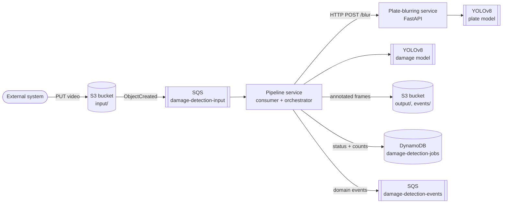

# Architecture

Two Python services plus a LocalStack AWS emulator. The pipeline is fully event-driven — no synchronous API is exposed to the caller. An external system uploads a video to S3; everything downstream is triggered by the S3 object-created event.

## Infrastructure diagram

## Pipeline stages

Per job, the orchestrator runs sequentially:

1. **Frame extraction** — OpenCV, configured via `FRAME_EXTRACTION_FPS`
2. **Damage detection** — YOLOv8 inference per frame, draws bounding boxes
3. **Plate blurring** — HTTP call to the blurring service; job fails if the service is unreachable
4. **Output write** — annotated frames to `s3://<bucket>/output/<job_id>/`

## Job state machine

`pending → processing → completed | failed`

- Duplicate message for an already-completed job → skip and log.
- Jobs left in `processing` on startup → marked `failed` (crash recovery); operator re-triggers by replaying the SQS event.
- Job ID is derived from the S3 key minus the `input/` prefix.

## Environment variables

Pipeline service (see [`docker-compose.yml`](../docker-compose.yml)):

| Variable | Default | Purpose |
|---|---|---|
| `AWS_ENDPOINT_URL` | `http://localstack:4566` | Set to empty for real AWS |
| `S3_BUCKET` | `damage-detection-local` | Input/output/events bucket |
| `SQS_INPUT_QUEUE_URL` | LocalStack URL | Job trigger queue |
| `SQS_EVENTS_QUEUE_URL` | LocalStack URL | Domain event stream |
| `DYNAMODB_TABLE` | `damage-detection-jobs` | Job records |
| `PLATE_BLURRING_URL` | `http://plate-blurring:8001` | Blurring service base URL |
| `FRAME_EXTRACTION_FPS` | `1.0` | Frames per second to extract |
| `DAMAGE_MODEL_PATH` | `/app/models/damage_model.pt` | YOLOv8 weights |
| `DAMAGE_CONFIDENCE` | `0.45` | Detection threshold |

Plate-blurring service:

| Variable | Default | Purpose |
|---|---|---|
| `PLATE_MODEL_PATH` | `/app/models/plate_model.pt` | YOLOv8 weights |
| `PLATE_CONFIDENCE` | `0.45` | Detection threshold |
| `BLUR_KERNEL_SIZE` | `51` | Gaussian kernel (odd) |
| `PORT` | `8001` | FastAPI port |
